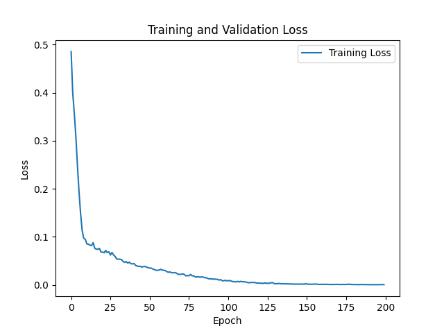
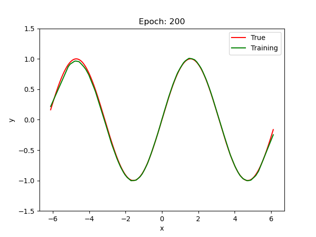

# Sine Function Approximation Neural Network

## Model Details
**Model Type:** Neural Network

**Framework:** TensorFlow, Keras

**Purpose:** To approximate the sine function using a neural network.

## Intended Use
This model is designed for educational purposes to demonstrate how a neural network can learn and approximate a mathematical function, specifically the sine function. It can be used as a tutorial or a starting point for similar function approximation tasks.

## Model Description
The model is a fully connected feedforward neural network (Multi-Layer Perceptron) trained to approximate the sine function. The network takes a single input (a value in radians) and produces a single output (the sine of the input value).

## Training Data
The training data consists of pairs of input values (in radians) and their corresponding sine values. The data is generated using the `numpy` library and split into training and testing sets.

## Training Procedure
1. **Data Generation:** Generate input values uniformly distributed over a specified range and compute their sine values.
2. **Model Definition:** Define a neural network with an appropriate number of layers and neurons.
3. **Compilation:** Compile the model with a loss function (e.g., Mean Squared Error) and an optimizer (e.g., Adam).
4. **Training:** Train the model on the generated data with appropriate callbacks for early stopping and model checkpointing.

## Evaluation
The model's performance is evaluated using Mean Squared Error (MSE) on a separate test set. 

Performance is visualized by plotting the predicted sine values against the true sine values. The plots are saved to a directory called [saved_plots](saved_plots).

## Limitations
- The model is trained on a specific range of input values. Its performance outside this range may not be reliable.
- This is a simple model intended for educational purposes and may not be optimized for high-precision applications.

